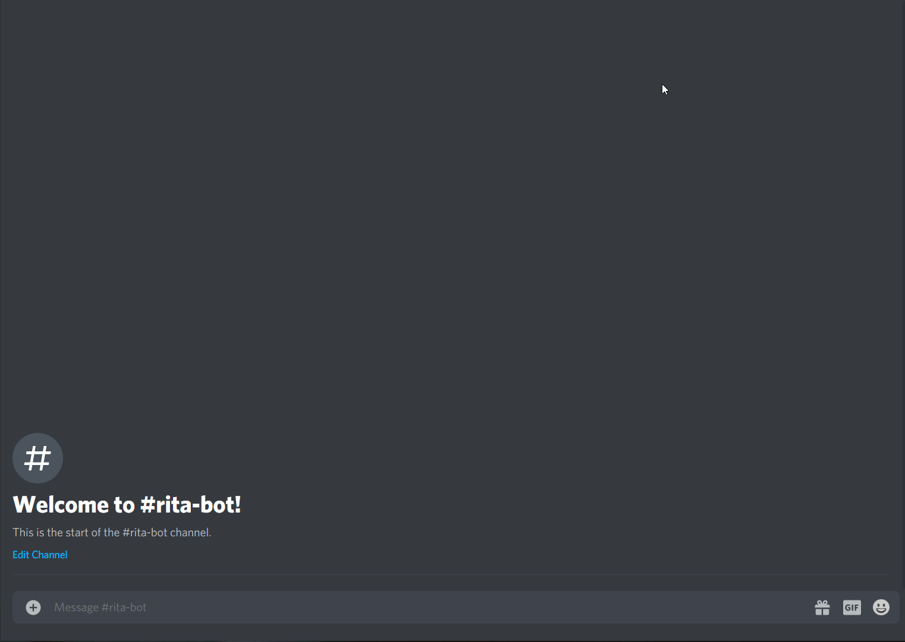

[](https://twitter.com/iKurasad) 

<p>
  <a href="https://github.com/DPulavarthy/rita" target="_blank">
    
    <a href="https://www.pixiv.net/en/users/6831531">Credit to the artist</a>
  </a>

  <h3 align="center"> Rita </h3>
  <p align="center">
    A Discord bot with some cool features
    <br />
    <a href="https://kura.gq"><strong> Visit the owner » </strong></a>
    <br />
    <br />
    <a href="https://support.jonin.gq"> Contact </a>
    ·
    <a href="https://github.com/DPulavarthy/rita/issues"> Report Bug </a>
    ·
    <a href="https://github.com/DPulavarthy/rita/issues"> Request Feature </a>
  </p>
</p>

### About
Rita is your bot helper with simple to use commands and only responds to the owner. Created in Discord.JS v12 this bot is lightweight and fast. Some features include: AI chat, text tags, [music commands](https://github.com/eritislami/evobot), and more!

***Note:*** Due to the existence of text/image tags, the bot cannot be hosted on [Heroku](http://heroku.com/), my version is hosted on a Raspberry Pi.

### Image tags


### Text tags


### How to Use
***NOTE:*** This bot's complexity of the code is not meant for beginners and might be confusing. But if you do not know how it works, I will gladly help you. (Discord: [Kurasad#2521](https://discord.com/users/476812566530883604)). This bot is made for advanced programmers; if you cannot understand anything about this bot, it might not be the right fit for you.

After forking the project add the proper information for the following files.

Find `.env.example` and rename the file to `.env` and open the file, the following should be shown
```
TOKEN=DISCORD_BOT_TOKEN
PREFIX=DISCORD_BOT_PREFIX
```
Fill in with the proper information (There are many guides on how to make a bot application in the [Discord Developer Portal](https://discord.com/developers/applications) and get a bot token), The prefix checks for args instead of characters so use a prefix such as `rita pls` instead of `!r`
Once the `.env` file is properly filled out open the following directory `./resources/util.js.example`

Fill out the information with the required data
```js
module.exports = {
    owner: {
        id: "OWNER_DISCORD_ID",
        link: "OWNER_SOCIAL_LINK",
        site: "OWNER_WEBSITE_LINK",
    },
    main: "#MAIN_EMBED_COLOR_HEX",
    failed: "#FF0000",
    loading: "#2E6FD6",
    key: {
        alexa: "aw2plm",
        google: "GOOGLE_API_KEY"
    }
}
```
***Note:*** The Alexa API key is a public key from [NPM alexa-bot-api](https://www.npmjs.com/package/alexa-bot-api)

***Note:*** The owner id is important, without it the bot will not respond to anyone. Remember, this is a private bot so it will only respond to the owner

Then, rename the folder `data.example` to just `data`

***Note:*** The data folder is where data for the bot is saved, without renaming it, the bot will likely crash.

Once those three things are updated, 'cd' to the bot directory

run `npm i` and then `node rita.js` 

***Note:*** The index file is rita.js and not index.js

### Other
Feedback is an amazing thing and feature additions are awesome, but to keep this bot simple I will try to only accept requests that do not change the bot much or majorly impact the speed.

I am the bot creator of [Jonin](https://top.gg/bot/662517805983334416) and after many requests wanted to make a simpler bot for public use.

If you understand this code, amazing.. come [hangout](https://discord.gg/H5PwwSJ) with me or help me develop [Jonin](https://top.gg/bot/662517805983334416/)

## Command list as of August 09, 2020
### I will be settting the prefix to mine (`rita pls`) in the table below

| Generl |
|--------|
| `rita pls` about <br /> `rita pls` ask <br /> `rita pls` debug <br /> `rita pls` eval <br /> `rita pls` explain <br /> `rita pls` help <br /> `rita pls` img <br /> `rita pls` ping <br /> `rita pls` tag <br /> `rita pls` uptime |

| Music |
|-------|
| `rita pls` loop <br /> `rita pls` np <br /> `rita pls` pause <br /> `rita pls` play <br /> `rita pls` queue <br /> `rita pls` remove <br /> `rita pls` resume <br /> `rita pls` search <br /> `rita pls` shuffle <br /> `rita pls` skip <br /> `rita pls` stop <br /> `rita pls` volume |
